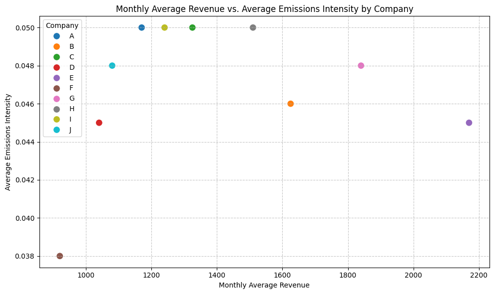

# ESG Reporting Workflow

This prototype demonstrates a Python-based ESG reporting workflow that transforms mock source data into structured analysis and an Excel report.

*Example chart from the mock dataset. It illustrates analysis output, not a real-company finding.*

## Objective

To illustrate how structured data workflows can improve ESG and financial reporting by:

- Automating data ingestion and cleaning
- Separating valid reporting data from data quality issues
- Generating performance and sustainability metrics
- Producing repeatable, analysis-ready outputs

## Workflow Overview

The workflow follows a structured pipeline:

1. **Data Ingestion**
   - Reads a published Google Sheet containing mock ESG data

2. **Data Cleaning & Structuring**
   - Converts key fields (Revenue, Costs, Emissions) to numeric formats
   - Standardizes date fields and derives time-based metrics
   - Calculates:
     - Profit
     - Profit Margin
     - Emissions Intensity

3. **Data Quality Validation**
   - Identifies incomplete or invalid records
   - Separates:
     - Reporting-ready data
     - Data quality issues for follow-up

4. **Analysis & Insights**
   - Revenue trend and growth analysis
   - Company-level profitability benchmarking
   - Correlation between financial performance and emissions intensity
   - Regional performance and sustainability comparison
   - Data quality diagnostics

5. **Automated Reporting Output**
   - Exports structured outputs to Excel
   - Generates multiple reporting sheets
   - Embeds charts and dynamic commentary
   - Produces a report from the published mock dataset

## Key Takeaways

- Data quality validation significantly improves reliability of reporting outputs
- ESG and financial performance can be analyzed together using structured datasets
- The same mock source can be reprocessed through the notebook when refreshed
- Automation reduces manual effort and improves consistency across reporting cycles

## Tools & Technologies

- Python
- pandas
- matplotlib
- seaborn
- Jupyter Notebook (also works in Colab)
- Google Sheets
- xlsxwriter

## Notes

- This project uses **mock ESG data** for demonstration purposes
- The workflow is designed as a **prototype** to illustrate how reporting processes can be automated and scaled

## Repository Contents

- [`ESG_Reporting_Mock.ipynb`](ESG_Reporting_Mock.ipynb) — Main analysis and workflow notebook

## Run the example

1. Download or clone this repository and open a terminal in its root directory.
2. Install dependencies: `pip install pandas numpy matplotlib seaborn xlsxwriter jupyter`.
3. Start Jupyter with `jupyter notebook`, open [`ESG_Reporting_Mock.ipynb`](ESG_Reporting_Mock.ipynb), and run all cells in order.
4. The notebook reads a [published mock Google Sheet](https://docs.google.com/spreadsheets/d/e/2PACX-1vRoeeEhPKxDhKLEEkpVVtFTrpfr_uF7_A1AhfB7478rCgogD3JWbgBngXElsDIwZyscSZu-6HgT04qx/pub?output=csv), so an internet connection is required. It writes `ESG_Data_Analysis_Full.xlsx` to the current working directory.

The notebook's commentary and some company-level examples are written for this mock dataset. It is a learning and demonstration project, not a production reporting system or client deliverable. Its calculations should be reviewed before use with another dataset.

## Next Steps

Potential extensions of this workflow include:

- Integrating real company ESG datasets
- Adding forecasting and scenario analysis
- Automating data ingestion from APIs
- Expanding into financial planning and FP&A use cases
